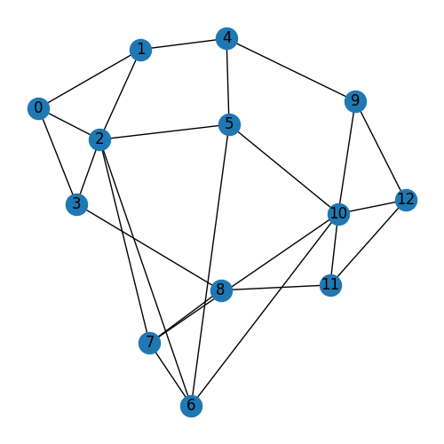
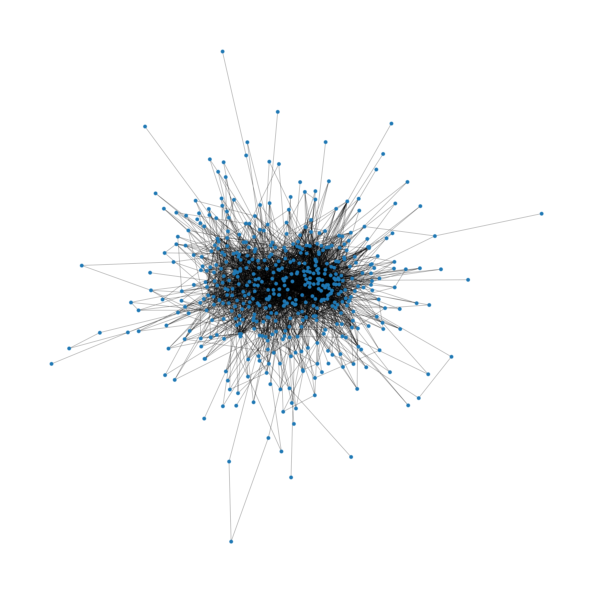

# Projeto final matematica discreta - CEFET/RJ, Prof: Diego Brandão.

> Projeto final matematica discreta: implemtação do algoritmo de agrupamento hierárquico, livro: Hunter, D.J. Fundamentos da Matemática Discreta

## MyDynamicArrayRealloc.h e MyDynamicArrayLk.h

Esses arquivos são bibliotecas que personalizadas. A versão utilizada é a "MyDynamicArrayRealloc.h", que faz alocação dinamica de arrays na memoria com "calloc" (contiguous memory allocation memory) e "realloc" (reallocate memory). A outra versão ("MyDynamicArrayLk.h"), implementa uma _Doubly Linked list_, e gera o mesmo resultado, porém o algoritmo demora mais (maior complexidade de tempo), visto que é perdido a propriedade de acesso aleatório de arrays. Portanto, por ser mais rápida, a biblioteca "MyDynamicArrayRealloc" é a utilizada.

## Uso:

### Questao 5 e 6

```shell
g++ questao5e6_v2.cpp -o questao5e6_v2.exe
```

```shell
./questao5e6_v2.exe M
```

- 'M' é o argumento informando ao algoritmo que será usado o maior peso. Argumento opcional,
  o default eh pegar o maior peso.

```shell
./questao5e6_v2.exe m
```

- 'm', argumento que informa ao algoritmo para usar o menor peso. Referente à questão 6.

Após executar o código, serão gerados dois arquivos csv: "weightsMatrix.csv" e "output.csv"

- "weightsMatrix.csv" é a matriz de pesos do grafo que foi inserido, neste caso
  corresponde ao grafo na imagem nodesMapa.png

- "output.csv" é a saída do algoritmo, no caso da questao5e6 a saída é printada no console
  (como mostrado no algortimo no livro) e também é escrita nesse arquivo. Na questão 7, é
  apenas escrito o arquivo (não é printado no console), pois, por ter uma grande quantidade de
  vértices e arestas fica dificil de visualizar a saída.

### Questao 7

```shell
g++ questao7extra.cpp -o questao7extra.exe
```

```shell
./questao7.exe
```

Assim como a questao 5 e 6, gera os arquivos "weightsMatrixFromDataset.csv" e "outputFromDataset.csv"

### Python plot Graphs

Os arquivos ".csv" gerados pelo código em c++, são lidos pelo código em python "dataVisualizer.py"
e gera as imagens:

- "Graph.png" correspondente a "weightsMatrix.csv"

<p align="center">
  
</p>

- "GraphOutput.png", correspondente a "output.csv"

<p align="center">
  
</p>

Analogamente, o arquivo "dataVisualizerQ7.py" gera as imagens:

- "GraphFromDataset.png"
<p align="center">
  
</p>

- "GraphOutputFromDataset.png"

<p align="center">
  
</p>
