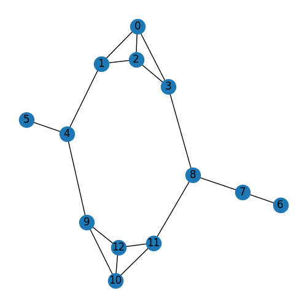

# Projeto final Matemática Discreta

Disciplina de Matématica Discreta, ministrada pelo professor Diego Brandão, do curso de Ciência da Computação - CEFET/RJ.

> Implementação do algoritmo de agrupamento hierárquico. Referência: Hunter, D.J. Fundamentos da Matemática Discreta

## Módulos MyDynamicArrayRealloc.h e MyDynamicArrayLk.h

A versão utilizada é a "MyDynamicArrayRealloc.h", que faz alocação dinamica de arrays na memoria com "calloc" (contiguous memory allocation memory) e "realloc" (reallocate memory). A outra versão ("MyDynamicArrayLk.h"), implementa uma _Doubly Linked list_, e gera o mesmo resultado, porém o algoritmo demora muito mais (maior complexidade de tempo), visto que é perdido a propriedade de acesso aleatório de arrays. Portanto, por ser mais rápida, o módulo "MyDynamicArrayRealloc" é o utilizado.

O peso entre as arestas na questão 5 e 6 é inserido de acordo com a imagem "nodesMapa.png".

O peso entre as arestas na questão 7 é o inverso da distancia euclidiana baseada nos valores de idade e extroversão entre dois vértices. Dessa maneira, quanto mais próximo for um node do outro, menor será a sua distancia e maior será seu peso.

## Uso:

### Questao 5 e 6

```shell
g++ questao5e6_v2.cpp -o questao5e6_v2.exe
```

```shell
./questao5e6_v2.exe M
```

- 'M' é o argumento informando ao algoritmo que será usado o maior peso. Argumento opcional,
  o default eh pegar o maior peso.

```shell
./questao5e6_v2.exe m
```

- 'm', argumento que informa ao algoritmo para usar o menor peso. Referente à questão 6.

Após executar o código, serão gerados dois arquivos csv: "weightsMatrix.csv" e "output.csv"

- "weightsMatrix.csv" é a matriz de pesos do grafo que foi inserido, neste caso
  corresponde ao grafo na imagem nodesMapa.png

- "output.csv" é a saída do algoritmo, no caso da questao5e6 a saída é printada no console
  (como mostrado no algortimo no livro) e também é escrita nesse arquivo. Na questão 7, é
  apenas escrito o arquivo (não é printado no console), pois, por ter uma grande quantidade de
  vértices e arestas fica dificil de visualizar a saída.

### Questao 7

```shell
g++ questao7extra.cpp -o questao7extra.exe
```

```shell
./questao7extra.exe
```

Assim como a questao 5 e 6, gera os arquivos "weightsMatrixFromDataset.csv" e "outputFromDataset.csv"

### Python plot Graphs

Os arquivos ".csv" gerados pelo código em c++, são lidos pelo código em python "dataVisualizer.py"
e gera as imagens:

- "Graph.png" correspondente a "weightsMatrix.csv"

<p align="center">
  
</p>

- "GraphOutput.png", correspondente a "output.csv" (saída do algoritmo de agrupamento hierárquico)

<p align="center">
  
</p>

Analogamente, o arquivo "dataVisualizerQ7.py" gera as imagens:

- "GraphFromDataset.png"
<p align="center">
  
</p>

- "GraphOutputFromDataset.png" (saída do algoritmo de agrupamento hierárquico, que teve como entrada o dataset MQD500.graphml)

<p align="center">
  
</p>

### Ideias de otimização

O grafo que é gerado a partir do dataset MQD500.graphml tem 3896 arestas, mas a forma atual do código processa a aresta de A para B e armazena no array de arestas de A, de B para A e guarda no array de arestas de B. Uma abordagem em que é criado um Id único para cada aresta e é armazenado esse Id no node A e B parece ser interessante, assim apenas terão 3896 instâncias de Edge.

Também seria interessante em vez de criar um objeto Graph, que contem objetos Node e cada Node contém objetos Edge, implementar um [Hash Table](https://en.wikipedia.org/wiki/Hash_table), em outras palavras, um array de Linked List, em que o Id de um determinado node seria o Hash para selecionar a devida lista encadeada. A partir do node "Head" de uma Linked list, se ele aponta para "NULL" ou "nullptr", indica que ele não tem arestas, se ele aponta para outro Node, indica que ele possui uma aresta com esse node e a informação peso pode ser guardada neste node de origem.

### Visualização no Gephi


### Mapa do "Id" de cada node inserido na questão 5 e 6


